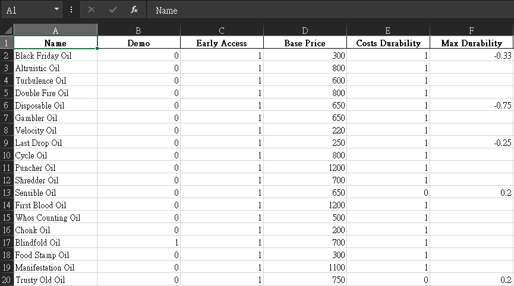

# SULFUR Toolkit
A toolkit to extract SULFUR oil and recipe data from `.bundle` files and unpack game assets.



## Getting Started
Example output files (.xlsx and .json) are available in [examples](examples/).  
If you want to extract assets or parse the latest `.bundle` files, follow the guide below.

## Dependencies
```
uv sync
```

## Executing program
### Oil & Recipe Data
First, copy `gamedefinitions_assets_all_*.bundle` this project directory:
You can find it at:
```
C:\Program Files (x86)\Steam\steamapps\common\SULFUR\Sulfur_Data\StreamingAssets\aa\StandaloneWindows64\
```
And the project directory should look like this:
```
.
├── LICENSE
├── README.md
├── examples
├── gamedefinitions_assets_all_623c92255bbcd7a85779cb867bb99261.bundle
├── pyproject.toml
├── requirements.txt
├── scripts
├── utils
└── uv.lock
```

1. Extract data from the bundle and save it into `./tmp/data.json`.
```
uv run parse_bundle.py
```
2. Parse `./tmp/data.json` to generate `.json` and `.xlsx` output files, see [examples](examples/).
```
uv run parse_json.py
```

### Assets
1. Copy `spritesitems_assets_all_*.bundle` into this project directory
2. Run the script below to unpack Sprite and Texture2D assets into `assets/`
```
uv run unpack_asset.py
```

## Acknowledgments
* [UnityPy](https://github.com/K0lb3/UnityPy/tree/master)