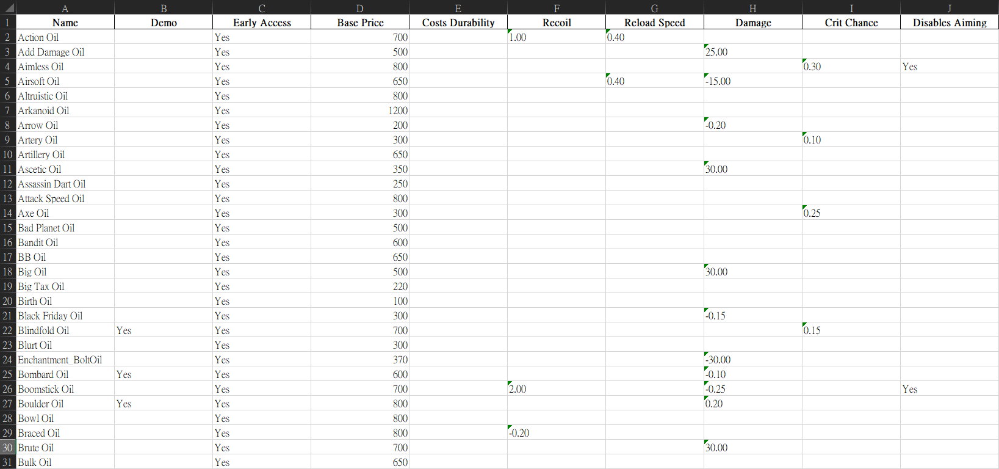

# SULFUR Oil Table

A simple Python script that parses oil data from a Unity .bundle file and exports it to an Excel worksheet.



## Getting Started

### Dependencies
- Python 3.13.2
- Install dependencies with:
```
pip install -r requirements.txt
```

### Executing program
1. Locate Game Definitions Bundle  

Copy the following file into this project directory:
```
gamedefinitions_assets_all_d7975836da373a5d7cd8a8695aeb3d27.bundle
```
You can find it at:
```
C:\Program Files (x86)\Steam\steamapps\common\SULFUR\Sulfur_Data\StreamingAssets\aa\StandaloneWindows64\
```
And the project directory should looks like this now:
```
.
├── LICENSE
├── README.md
├── demo.png
├── gamedefinitions_assets_all_d7975836da373a5d7cd8a8695aeb3d27.bundle
├── oils.xlsx
├── parse_bundle.py
├── parse_json.py
└── requirements.txt
```

2. Extract Oil data to JSON
```
python parse_bundle.py
```
3. Convert JSON to Excel
```
python parse_json.py
```

## Acknowledgments
* [UnityPy](https://github.com/K0lb3/UnityPy/tree/master)