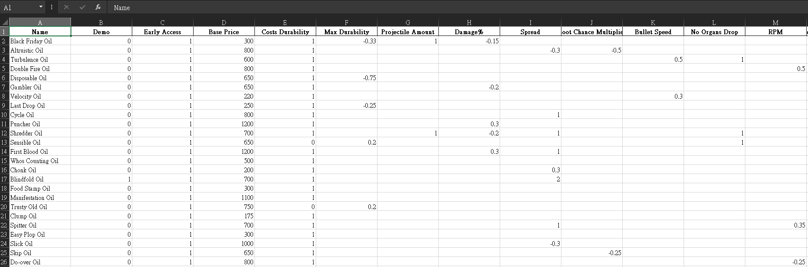

# SULFUR Toolkit
A simple script to generate SULFUR oil table and unpack assets from .bundle files.



## Dependencies
```
uv sync
```

## Executing program
### Oil Table
Copy the following file into this project directory:
```
gamedefinitions_assets_all_xxxxxxxxxxxxxxxxxxxxxxxxxxxxxxxx.bundle
```

You can find it at:
```
C:\Program Files (x86)\Steam\steamapps\common\SULFUR\Sulfur_Data\StreamingAssets\aa\StandaloneWindows64\
```
And the project directory should looks like this now:
```
.
├── LICENSE
├── README.md
├── examples
├── gamedefinitions_assets_all_xxxxxxxxxxxxxxxxxxxxxxxxxxxxxxxx.bundle
├── oils.xlsx
├── parse_bundle.py
├── parse_json.py
├── pyproject.toml
├── requirements.txt
├── utils
└── uv.lock
```

1. Extract data from .bundle and dump into `data.json`
```
uv run parse_bundle.py
```
2. Parse `data.json`
```
uv run parse_json.py
```

### Assets
Copy the following file into this project directory:
```
spritesitems_assets_all_xxxxxxxxxxxxxxxxxxxxxxxxxxxxxxxx.bundle
```
Then run the script below:
```
uv run unpack_asset.py
```

## Acknowledgments
* [UnityPy](https://github.com/K0lb3/UnityPy/tree/master)